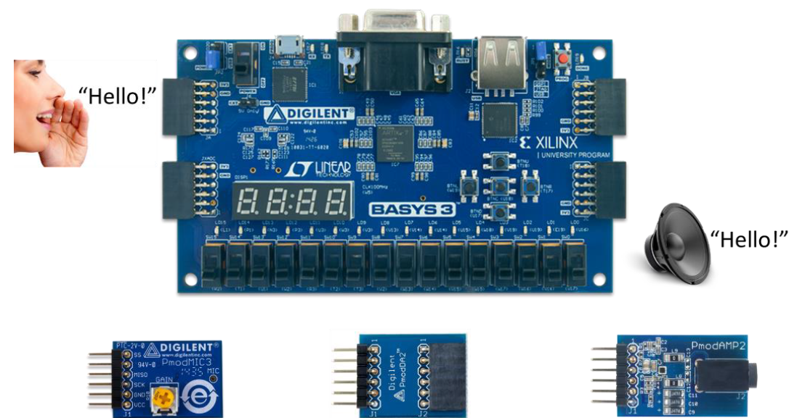

# Audio Effects
DJ sound mixer that is able to create remixes of voices, sounds and melodies
- Signal manipulation for real time audio pitch shifting and sound delay
- Through signal analysis, successfully implemented noise filter and sound merging functions

### Basic Features
- Real-time microphone-speaker system
- Microphone-speaker system that delays the sound output by 1s
- Piano player using switches
- Volume adjustment in piano mode (indicated with 7-segment)
- Octave adjustment in piano mode (indicated with 7-segment)

### Cool Features
- Microphone-speaker system with user adjustable sound delays and pitch levels (delays and pitch can be controlled with the joystick and current setting displayed on 7-segment)
- Recording mode with sound signals stored in a round buffer
- User adjustable duration and pitch of recorded sound eg. A 1s recorded sound clip can be dragged to play in a 2s duration while maintaining the same pitch (:tada: What scocery is that :tada:)
- Multiple switches can be pressed simultaneously in piano mode to play chords!!!
- LED ripple effect and LED shift when switches or buttons are toggled

### Super Cool Features
- Noise filtering mode which filters away unwanted background noises for clear and crisp voice sound (that doesn’t hurt your ears, how useful and user-friendly is that!)
_(Noise cancellation is not required for Musical Instrument modes and disabled during Sound Merging)_
- Simultaneous playback of an unlimited number of sounds created by the various features above when the various switches are toggled on at the same time
- **Bonus: timing, pitch, octave etc. adjustments can be done during sound merging**

## Getting Started
### Environment Prerequisites
#### Software used
- Xilinx Vivado

#### Languages used
- Verilog

#### Hardware
- Basys3 FPGA
- Digilent PmodDA2 (Digital to analog converter)
- Digilent PmodAMP2 (Analog amplifier)
- Diligent PmodMIC3 (Microphone)

## Deployment
<!-- todo: -->
1. Click generate bitstream
2. Wait approx 45mins
3. Upload to board and enjoy

## Authors
- [Terence Neo](https://github.com/terenceneo) <- really hard working guy
- [Clive Yuan](https://www.linkedin.com/in/clive-yuan-aaa69a157/) <- harder working guy

## Acknowledgements
- Christopher Moy for delivering labs lessons that are second to none (seriously, you got to experience them yourself)
- Cool lab staffs, tutors and graduate assisstants that were always there and always ready to clarify our doubts!